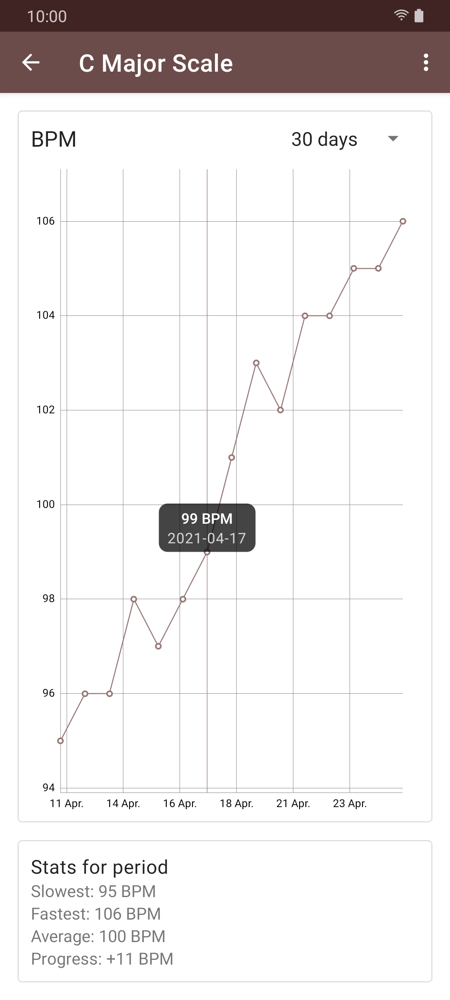
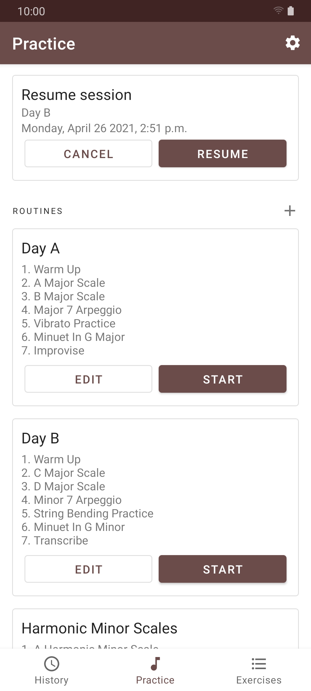
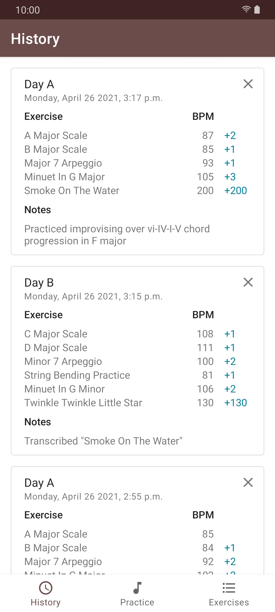
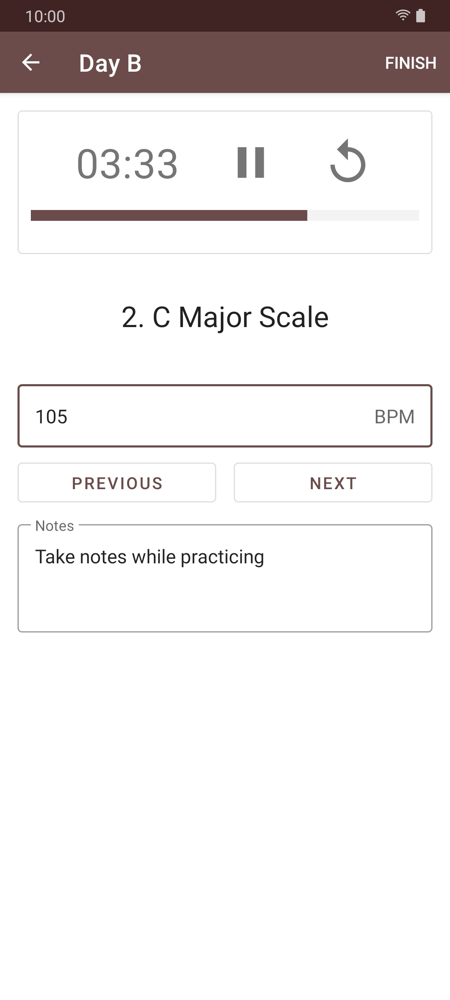

 
<h2 align="center"><b>Virtuosity</b></h2>
<h4 align="center">Organize and track your music practice</h4>

 

<a href="https://github.com/ramzan/virtuosity/releases/" alt="GitHub release">Get the APK</a>

 

## Screenshots

### Features

<b>Organize</b>: Create routines of the exercises you wish to practice.

<b>Practice</b>: Stay focused while practicing with a built in timer.

<b>Measure</b>: View logs of your previous practice sessions, as well as detailed graphs showing your performance (BPM) over time.

## License
  

Virtuosity is Free Software: You can use, study share and improve it at your
will. Specifically you can redistribute and/or modify it under the terms of the
[GNU General Public License](https://www.gnu.org/licenses/gpl.html) as
published by the Free Software Foundation, either version 3 of the License, or
(at your option) any later version.  

The app icon is derived from [Quarter rest musical note vector image](https://freesvg.org/quarter-rest-musical-note-vector-image) by [OpenClipart](https://freesvg.org/by/OpenClipart) released in the [public domain](https://creativecommons.org/licenses/publicdomain/).

[bell.mp3](https://github.com/ramzan/Virtuosity/blob/0e161192bbc887bb7b246cc81c4c40ef356106fd/app/src/main/res/raw/bell.mp3) is derived from [Boxing Bell.wav](https://freesound.org/people/Benboncan/sounds/66951/) by [Benboncan](https://freesound.org/people/Benboncan/) under [CC BY 3.0](https://creativecommons.org/licenses/by/3.0/).
